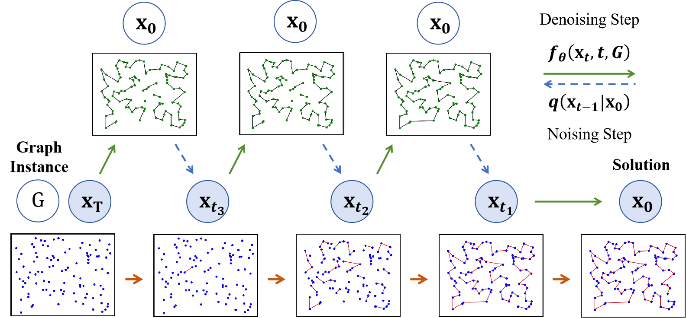

# StruDiCO: Structured Denoising Diffusion with Gradient-free Inference-stage Boosting for Memory and Time Efficient Combinatorial Optimization

Official implementation of **NeurIPS 2025** paper "[StruDiCO: Structured Denoising Diffusion with Gradient-free Inference-stage Boosting for Memory and Time Efficient Combinatorial Optimization](https://openreview.net/forum?id=P69X3V4WwH)".



Diffusion models have recently emerged as powerful neural solvers for combinatorial optimization (CO). However, existing approaches fail to reveal how variables are progressively determined during inference, making the final solution opaque until the last step. To address this limitation, we propose a structured denoising diffusion model, StruDiCO, which incrementally constructs solutions through step-wise variable selection. This is achieved via a variable-absorption noising model, wherein the forward process simulates gradual variable deactivation, converging to an empty solution, while the reverse process incrementally selects variables to reconstruct the final solution. This design induces structural continuity across intermediate states, enabling interpretable and trajectory-consistent partial solutions throughout inference. To further improve the reliability of reverse inference, we introduce a constrained consistency sampling strategy, which suppresses low-confidence variable selection at each step to stabilize the reverse process. Leveraging the structure-preserving reverse process, we further propose a lightweight, gradient-free, objective-aware refinement framework, which iteratively improves solution quality by applying structure-aware perturbations to the current solution, performing reverse inference through the constraint consistency model, and decoding with an objective-guided scoring scheme. Extensive experiments on two canonical CO tasks, the Traveling Salesman Problem (TSP) and Maximal Independent Set (MIS), show that StruDiCO outperforms state-of-the-art diffusion-based solvers, achieving up to 
 faster inference, 70% lower GPU memory usage, and significantly improved solution quality, with up to 37.7% drop reduction on TSP and an average 38.1% improvement on MIS.

## Setup

The implementation is primarily developed on top of [DIFUSCO](https://github.com/Edward-Sun/DIFUSCO)'s code foundation.

```bash
conda env create -f environment.yml
conda activate strudico
```

Running TSP experiments requires installing the additional cython package for merging the diffusion heatmap results:

```bash
cd diffusion/utils/cython_merge
python setup.py build_ext --inplace
cd -
```

## Data and Pretrained Checkpoints

We provide the evaluation data for TSP in `data`. The pretrained model checkpoints of StruDiCO are provided in `ckpts` fold.


## Reproduction

The training and evaluation scripts for StruDiCO can be directly found in `scripts` folder.

The training data is the same as that used in [Fast-T2T](https://github.com/Thinklab-SJTU/Fast-T2T).  


